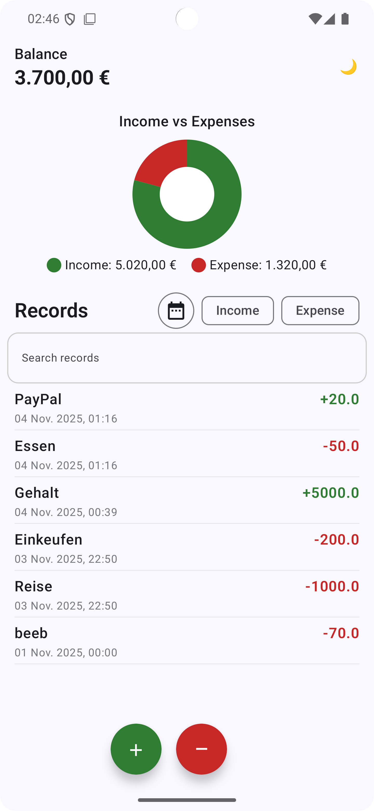

# Budget Tracker App

[](https://kotlinlang.org/)
[](https://developer.android.com/jetpack/compose)
[](https://developer.android.com/jetpack/architecture)
[](https://developer.android.com/training/data-storage/room)
[](https://insert-koin.io/)
[](LICENSE)

---

## Overview

Budget Tracker is an Android app to track daily **income** and **expenses**.  



---

## What's New?

1️⃣ Migrating from Hilt → Koin
2️⃣ Adding a custom app icon
3️⃣ Implementing a modern splash screen

---

## Features

- Add, delete, and view income and expense transactions
- Automatically calculate current balance
- Search your transaction records
- Data persisted locally  
- Pie chart visualization of Income vs Expenses
- Dark mode toggle

---

## Tech Stack

- **Language:** Kotlin  
- **UI:** Jetpack Compose  
- **Architecture:** MVVM  
- **Dependency Injection:** Koin  
- **Database:** Room  
- **Asynchronous:** Kotlin Coroutines & Flow  
- **Testing:** JUnit, kotlinx-coroutines-test  

---

## Project Structure

- `data/`  
  - `local/` → Room entities, DAO, Database  
  - `repository/` → Repository implementation  

- `domain/`  
  - `model/` → TransactionRecord, TransactionType  
  - `repository/` → Repository interface  

- `ui/`  
  - `BudgetTrackerScreen/` → HomeScreen, TransactionsList, ViewModel  
  - `components/` → Reusable composables (TransactionListItem, BudgetTopBar, etc.)  
  - `utils/` → Extensions (currency, date formatting)  

- `di/` → Koin Modules

---

## Getting Started

1. Clone the repository:

```bash
git clone https://github.com/githussein/BudgetTrackerChallenge.git
```

2. **Build requirements:**
- Android SDK 34+ (Target SDK 36)
- Java 17
- Kotlin + Jetpack Compose

3. **Key plugins and libraries used:**  
- Koin for Dependency Injection  
- Room for local database  
- Jetpack Compose for UI  
- Kotlin Symbol Processing (KSP)
- AndroidX SplashScreen API

All necessary dependencies are managed in the `build.gradle` file. Modern build-files approaches like toml, ksp, and Kotlin DSL are adopted in this project.

